# AI Pair Engineer — cross-model review loop & trust gate

> Most AI coding tools stop at *"here's a fix."* This one **reviews its own work with a
> second model** and **knows when it's allowed to act** — and ships with an evaluation
> harness that measures exactly that.

Give it a Python function and it:

1. **Detects** the most important flaw (grounded in a best-practices knowledge base via RAG),
2. **Writes a failing test** that reproduces the flaw,
3. **Refactors** it inside a bounded **code → review → feedback loop**, where a *different
   reviewer model* and the test results feed back until the change converges,
4. and a deterministic **trust gate** decides: **`auto-apply`**, **`suggest`**, or
   **`escalate-to-human`** — never auto-applying a fix that fails its test or changes
   existing behavior.



## Why it's trustworthy (the deterministic spine)

The two things that matter most — *deciding whether the agent may act* and *proving a fix
works* — are plain, auditable code, **not** the LLM:

- **`trust_decision`** (in [`agents.py`](agents.py)) is a deterministic policy. Its safety
  invariant — *never `auto-apply` unless the fix passed its test **and** preserved behavior* —
  is checked exhaustively in the selftest.
- **`executor.py`** runs the original and refactored function in a timeboxed subprocess and
  compares — red→green proof and behavior-preservation, not "looks right."

The LLM is fallible; this layer isn't — which is what makes the eval numbers trustworthy.

## Evaluation (the point of the project)

`evals.run_eval()` runs every labeled snippet through the pipeline and reports:

- **Unsafe auto-applies** — the headline safety guarantee (target **0**).
- **Trust-gate quality** — precision / recall / F1 of `auto-apply` vs. the `should_auto_apply` labels.
- **Fix-rate lift from the loop** — pass-rate at iteration 0 vs. final (does the cross-model loop earn its cost?).
- **Detection** — has-flaw and severity accuracy; **behavior-preservation** rate.
- **Groundedness** — an LLM-judge *proxy* for whether the critique is grounded in the KB.
- **Latency** (median / p95) and an **edge-case** table.

**Harness sanity check (offline replay, no key):** replaying the dataset's reference solutions
reproduces the labels exactly — **6 auto-apply / 3 suggest / 2 escalate**, **0 unsafe**,
auto-apply P/R/F1 = 1.0 — confirming the harness + dataset + trust policy are coherent.

**Real-model results:** run the dashboard with a Gemini key and paste your numbers here:

| metric | value |
|---|---|
| unsafe auto-applies | _your run_ |
| auto-apply P / R / F1 | _your run_ |
| fix-rate lift (loop) | _your run_ |
| has-flaw / severity accuracy | _your run_ |
| groundedness (proxy) | _your run_ |

> _Replace with your `Run eval` output. Screenshots in [`docs/`](docs/)._

**Honest caveats:** the dataset is small (n=11) — numbers are directional. Groundedness is a
proxy. Fix-rate *lift* only appears with a real model (offline replay nails the fix on the first
try). The executor is a timeboxed subprocess, **not** a hardened sandbox.

## Run it (uv)

```bash
uv sync                                      # create env + install from pyproject.toml
TRIAGE_OFFLINE=1 uv run streamlit run app.py # offline replay — no API key needed
uv run streamlit run app.py                  # real models (see secrets below)
uv run python selftest.py                    # 55 offline checks — no key, no deps
```

For real models, copy [`.streamlit/secrets.toml.example`](.streamlit/secrets.toml.example) to
`.streamlit/secrets.toml` and set `GEMINI_API_KEY` (free tier:
<https://aistudio.google.com/apikey>). The file is git-ignored.

## Configurable, cross-model

Each agent role maps to a provider + model in [`config.py`](config.py) (overridable via the
`[models]` table in secrets). By default everything runs on Gemini 2.5 Flash, but the
**reviewer runs a *different* model** — independent eyes catch what a model misses in its own
work. The client is provider-pluggable (Gemini shipped; Anthropic/OpenAI are an adapter away).

## How I'd ship it

As a PR bot / CI check: comment the flaw + grounded rationale, attach the generated test, open
the refactor as a suggested change, and **auto-merge only when the gate says `auto-apply`**.
Full notes (sandbox hardening, prompt-injection, drift, cost) are in the app's *How I'd ship it* tab.

## Layout

```
app.py            # thin Streamlit entry point
ui/               # sidebar + the three tabs (live demo, dashboard, ship notes)
config.py         # per-role model routing + review-loop bound + offline flag
agents.py         # agent prompts + the deterministic trust_decision policy
llm.py            # provider-pluggable client (Gemini) + offline oracle mock
retriever.py      # pure-Python cosine retrieval over the KB
executor.py       # safe, timeboxed code execution
pipeline.py       # detect → test → cross-model review loop → trust gate
evals.py          # pure metric functions + run_eval()
selftest.py       # 55 offline checks (no key, no third-party deps)
snippets.json     # 11 labeled code snippets   practices.json # best-practices KB
docs/             # trust-gate diagram (+ screenshots)
```

## Tests

`uv run python selftest.py` — covers the trust gate (incl. the safety invariant via an
exhaustive grid), the executor, the metric math, dataset/label consistency, the LLM client,
and an end-to-end pipeline run — all offline, no key, no third-party packages.
