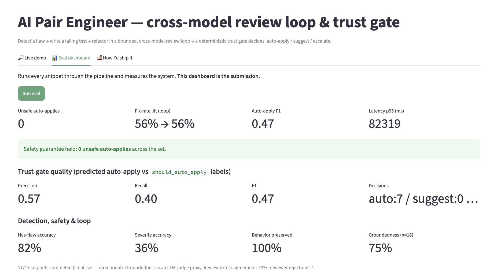

# AI Pair Engineer — Submission

An AI pair engineer that detects a code flaw, writes a failing test, refactors it in a bounded
**cross-model review loop**, and — behind a deterministic **trust gate** — decides whether to
`auto-apply`, `suggest`, or `escalate-to-human`. It ships with a real **evaluation harness** that
measures the system on labeled code.

## 1. Prototype — code, document & screenshots

- **Repository (public):** https://github.com/rebase-master/ai-code-reviewer
- **Full writeup:** [README](https://github.com/rebase-master/ai-code-reviewer/blob/main/README.md) —
  architecture, real eval results, and an honest *"what breaks & how I'd fix it"* section.
- **No hosted URL, on purpose:** one eval run makes ~100 model calls, which would exhaust a free API
  tier behind a shared link. It runs in ~1 minute locally, and an **offline replay mode** demos the
  whole thing with no API key.

**Eval dashboard (this is the submission):**



**Trust-gate decision flow:** [docs/trust-gate-decision-flow.svg](docs/trust-gate-decision-flow.svg)

**Run it yourself:**
```bash
uv sync
TRIAGE_OFFLINE=1 uv run streamlit run app.py   # offline replay — no API key
uv run streamlit run app.py                     # real models (GEMINI_API_KEY in .streamlit/secrets.toml)
uv run python selftest.py                        # 68 offline checks — no key, no deps
```

## 2. Public dataset (self-created)

- **Labeled code snippets:** https://github.com/rebase-master/ai-code-reviewer/blob/main/snippets.json
- **Best-practices KB (RAG grounding):** https://github.com/rebase-master/ai-code-reviewer/blob/main/practices.json

17 self-contained Python functions with labeled flaws, reference fixes, and tests (config coercion,
off-by-one, missing validation, XSS, a clean control, …). Self-created per the brief's "self-created"
allowance; no confidential data.

## 3. 100-word summary

> Most code-review demos print suggestions. I built an AI pair engineer that knows when it's
> *allowed to act*. Given a function, it detects a flaw (grounded in a best-practices KB), writes a
> failing test, and refactors inside a bounded loop where a *different* reviewer model and the test
> results feed back. A deterministic trust gate then decides auto-apply / suggest / escalate — never
> auto-applying a fix that fails its test or changes behavior. It ships with an evaluation harness
> over labeled code measuring trust precision/recall, fix-rate, and a headline guarantee — zero
> unsafe auto-applies — plus an honest analysis of where it breaks.

## What's inside (1-minute orientation)

- **Pipeline:** detect (RAG-grounded) → write a failing test → refactor in a bounded, cross-model
  review loop → **deterministic trust gate** (auto-apply / suggest / escalate).
- **Why it's trustworthy:** the trust gate and a sandboxed executor are plain, auditable code — not
  the LLM — so the headline held in a live run: **0 unsafe auto-applies** across the set, even where
  the model under-rated severity or wrote weak tests.
- **Measured honestly:** the real free-tier numbers are reported next to their failure modes
  (severity-gating gaps, a weak test-author) and concrete fixes — the point is measuring where it's
  safe to ship, not a flattering score.
- **Verifiable offline:** 68 `selftest` checks cover the trust policy, the executor, the metrics, and
  an end-to-end run — no API key or third-party dependencies.
